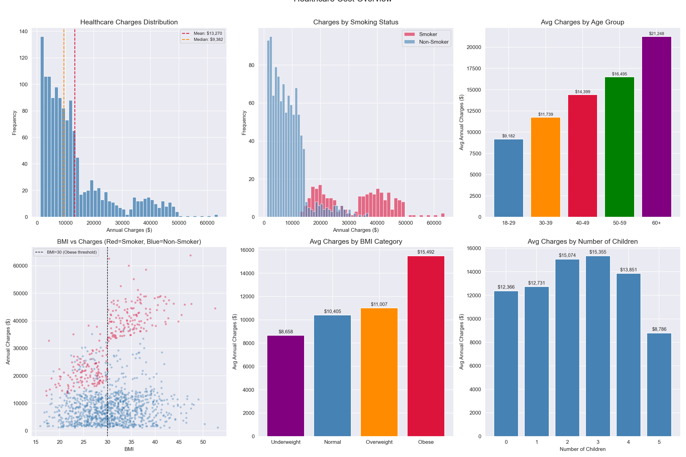
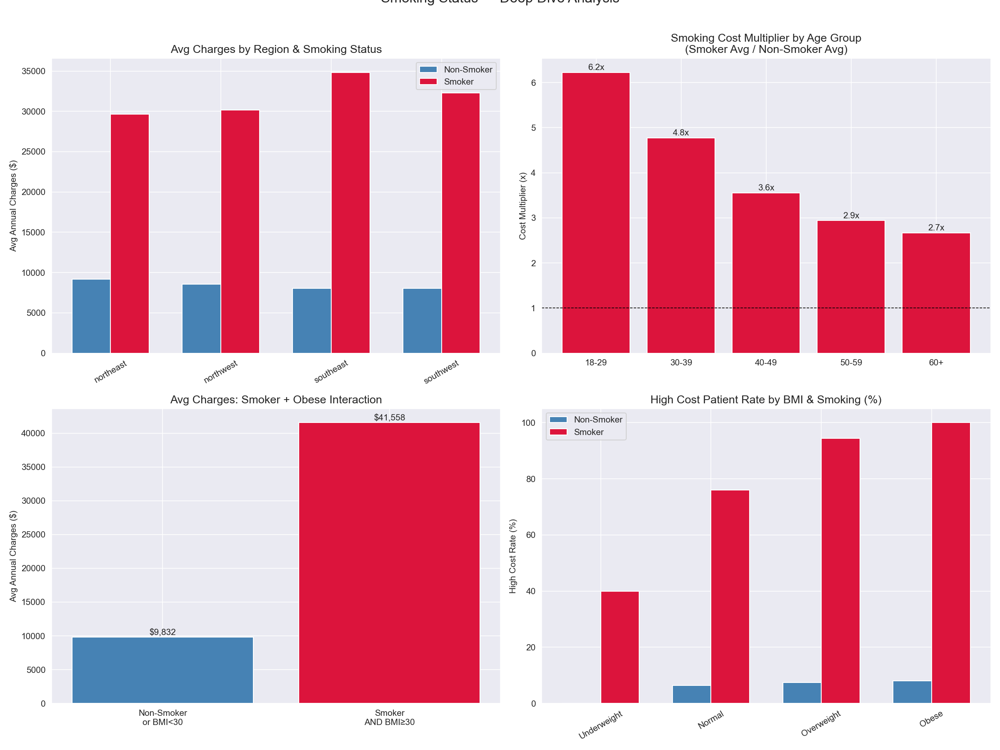
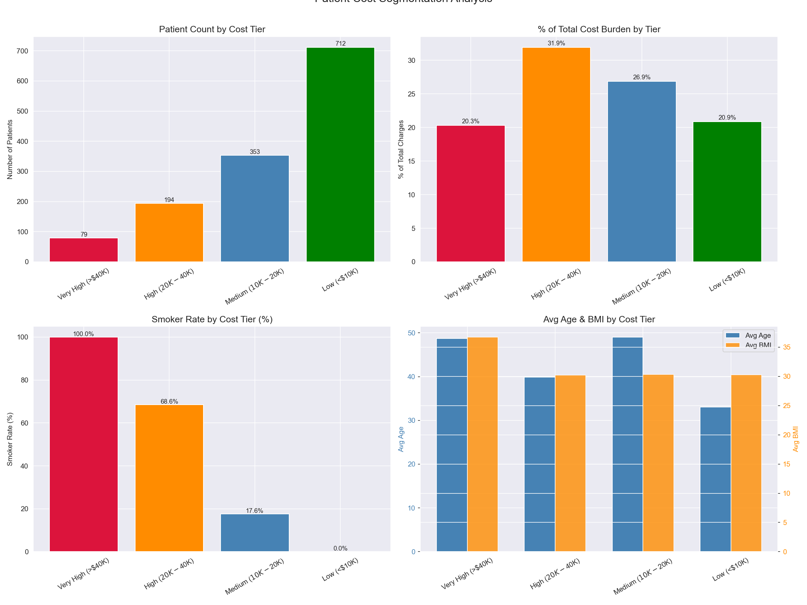
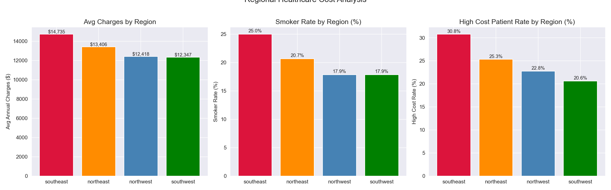
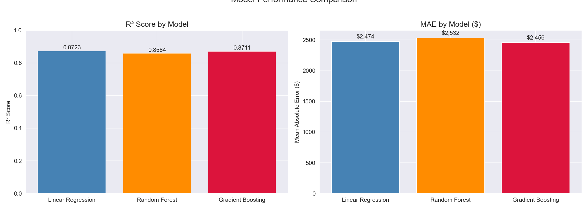
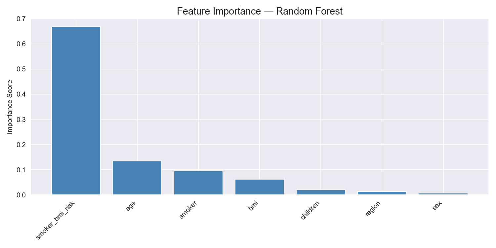
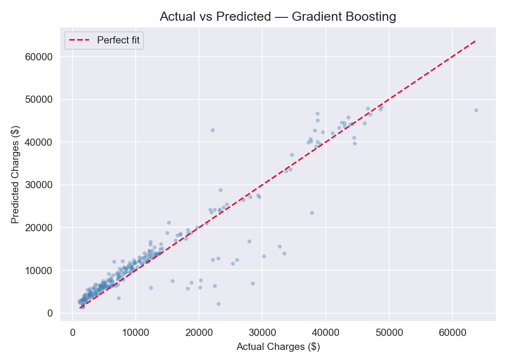

# Healthcare Cost Analysis — Medical Billing, Claims & Cost Drivers

A SQL and Python analysis of 1,338 patient records examining the primary drivers of annual medical charges, building a cost segmentation framework, and developing machine learning regression models to predict individual patient charges — a core actuarial function in health insurance pricing.

---

## Problem Statement
Healthcare costs in the United States are among the highest in the world and continue rising year over year. This project analyzes patient demographics, health behaviors, and regional factors to answer:
- Which patient characteristics most strongly drive healthcare costs?
- How do smoking status and BMI interact to amplify cost burden?
- Can machine learning accurately predict individual patient charges?
- How are costs distributed across patient segments and regions?

---

## Dataset
- **Source:** [Kaggle — Medical Cost Personal Dataset](https://www.kaggle.com/datasets/mirichoi0218/insurance)
- **Size:** 1,338 patients, 7 features
- **Mean Annual Charges:** $13,270.42
- **Median Annual Charges:** $9,382.03
- **Smoker Rate:** 20.48%
- **Database:** PostgreSQL (local)

---

## Tools & Libraries
- PostgreSQL, pgAdmin
- Python 3.x
- Pandas, NumPy
- Matplotlib, Seaborn
- Scikit-learn (Linear Regression, Random Forest, Gradient Boosting)
- SQLAlchemy, psycopg2

---

## Project Workflow
1. Data ingestion — loaded CSV into PostgreSQL via Python, engineered age groups, BMI categories, high-cost flag, and smoker-BMI interaction term
2. SQL analysis — cost summary by demographics, risk factor analysis, cost segmentation with Window Functions, regional percentile analysis using PERCENTILE_CONT
3. Python visualization — charge distributions, smoker deep dive, cost segmentation, regional analysis, model evaluation
4. Predictive modeling — charge regression using Linear Regression, Random Forest, and Gradient Boosting with 5-fold cross-validation

---

## SQL Techniques Demonstrated
- Common Table Expressions (CTEs)
- Window Functions (RANK, NTILE, PARTITION BY for regional and smoker averages)
- PERCENTILE_CONT ordered-set aggregate for median, Q1, Q3, and P90 charge calculations
- Conditional aggregation (CASE WHEN) for high-cost and smoker counting
- NULLIF for safe division in rate calculations
- Multi-dimensional GROUP BY across demographics, risk factors, and regions

---

## Key Findings
- **Smokers average $32,050.23 in annual charges — 3.80x the $8,434.27 non-smoker average** — the dominant cost driver, justifying tobacco rating in health insurance underwriting
- **Young smokers (18-29) show a 6.23x cost multiplier** — declining to 2.67x at age 60+, confirming tobacco rating should be most aggressively applied to younger policyholders
- **Smoker + Obese patients average $41,557.99 — 4.23x all other patients** — the multiplicative interaction between smoking and obesity is the highest-risk patient profile and primary target for wellness intervention ROI
- **79 patients (5.9%) drive 20.32% of total cost burden** — combined with High tier, top 20.4% of patients generate 52.25% of total charges, consistent with real-world healthcare cost concentration
- **Southeast shows highest avg charges ($14,735) and smoker rate (25%)** — nearly 50% above lowest-smoking regions, confirming regional cost differences are behavioral not structural
- **Linear Regression achieved the highest R² (0.8723)** — outperforming ensemble models, revealing dominant cost drivers have largely linear relationships when the smoking-obesity interaction is properly engineered
- **smoker_bmi_risk accounts for 66.78% of Random Forest feature importance** — the engineered interaction feature dominates all others, confirming feature engineering was the most impactful modeling decision
- **$2,456–$2,474 MAE with R² of 0.87 from just 7 features** — exceptionally strong result confirming key risk factors are well-identified and measurable at enrollment

---

## Visualizations

### Cost Overview & Distributions

### Smoker Analysis Deep Dive

### Cost Segmentation

### Regional Analysis

### Model Comparison

### Feature Importance

### Actual vs Predicted Charts

---

## SQL Query Files
All queries are saved in the `sql/` folder:
- `01_create_table.sql` — schema creation with SERIAL PRIMARY KEY
- `02_cost_summary.sql` — cost summary by demographics with PERCENTILE_CONT median and RANK Window Function
- `03_risk_factors.sql` — cost impact of smoking, BMI, age, and children combinations
- `04_cost_segmentation.sql` — four-tier cost segmentation with NTILE deciles and PARTITION BY regional and smoker averages
- `05_window_functions.sql` — regional cost ranking with Q1, Q3, P90 percentiles and IQR calculation

---

## Limitations & Next Steps
- 1,338 patients is small by actuarial standards — real insurance pricing uses millions of claims records
- Binary smoker flag omits pack-years, cessation history, and tobacco type
- Dataset lacks diagnosis and procedure codes — key real-world cost drivers
- Future work: SHAP explainability, XGBoost, premium pricing calculator, smoking cessation ROI analysis, diagnosis code integration

---

## How to Run This Project
1. Clone the repository
2. Install PostgreSQL and pgAdmin from [postgresql.org](https://postgresql.org)
3. Create a database called `healthcare_costs` in pgAdmin
4. Download `insurance.csv` from [Kaggle](https://www.kaggle.com/datasets/mirichoi0218/insurance) and place it in the project root folder
5. Install Python dependencies: `pip install pandas numpy matplotlib seaborn scikit-learn sqlalchemy psycopg2-binary`
6. Open `healthcare_cost.ipynb` in Jupyter or VS Code
7. Update the database connection string with your PostgreSQL password
8. Run all cells — data loads automatically into PostgreSQL and all analysis runs end to end

---

## Repository Structure

---

## Author
**Mihrimah Qozat**
[LinkedIn](https://linkedin.com/in/mihrimah-qozat) |
[GitHub](https://github.com/mihrimahqozat)
